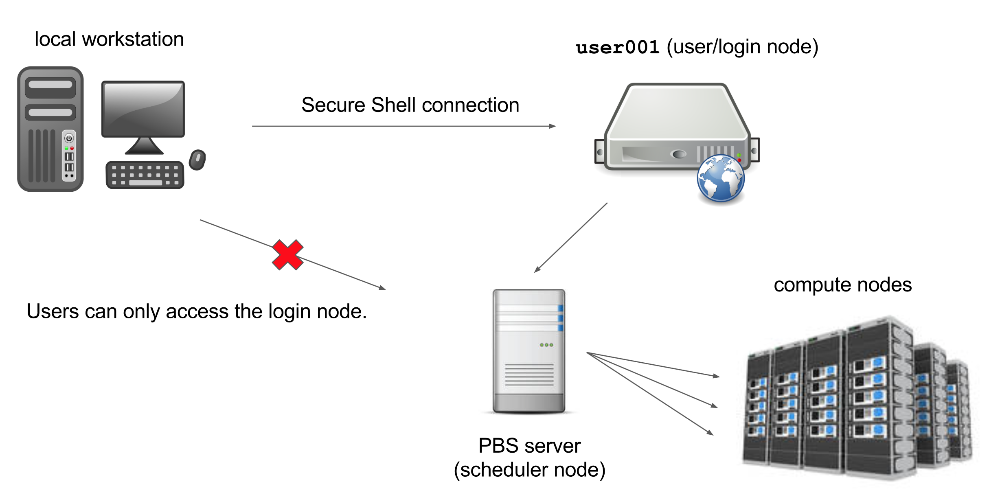

The computers that make up the Palmetto cluster are called *nodes*. Most of the nodes on Palmetto are *compute nodes*, 
that can perform fast calculations on large amounts of data. There is also a special node called the *login node*; it runs the server, 
which works like the interface 
between the cluster 
and the outside world. The people with Palmetto accounts can log into the server by running a client (such as `ssh`) on their local machines. 
Our client program passes our login credentials to this server, and if we are allowed to log in, the server runs a shell for us. 
Any commands that we enter into this shell are executed not by our own machines, but by the login node.

Another special node is the *scheduler*; Palmetto users can get from the
login node to the compute nodes by submitting a request to the scheduler, and the scheduler will assign them to the most appropriate compute node.
Palmetto also has a few so-called "service" nodes, which serve special purposes like transferring code and data to and from the cluster, and hosting web applications.

The Skylight nodes are integrated into Palmetto. To see the specifications of the Skylight compute nodes, let's type

To see the hardware specifications of the compute nodes, please type

~~~
cat /etc/hardware-skylight
~~~
{: .bash}

This will print out a text file with the hardware info. Please make sure you type exactly as shown; Linux is case-sensitive, space-sensitive, 
and typo-sensitive. The output will look something like this:

~~~
--------------------------------------------------------
SKYLIGHT HARDWARE TABLE      Last updated:  May 11 2021
--------------------------------------------------------

QUEUE   COUNT   MAKE   MODEL        CHIP(1)                CORES  RAM       /local_scratch   GPUs(2)

skystd    22    ACT    S2600TPFR    Intel Xeon E5-2640v4    20    125 GB    800 GB           0
skystd    24    Dell   R640         Intel Xeon 6230R        52    754 GB    3.4 TB           0

skylm      3    ACT    2USERVER     Intel Xeon E5-2680v4    28    503 GB    800 GB           0
skylm      5    Dell   R640         Intel Xeon 6230R        52   1500 GB    3.4 TB           0

skygpu     6    ACT    ESC4000G3    Intel Xeon E5-2640v4    20     62 GB    800 GB           4 x NVIDIA GTX1080
skygpu     2    ACT    2USERVER     Intel Xeon E5-2640v4    20    125 GB    800 GB           1 x NVIDIA P100
skygpu     6    Dell   DSS840       Intel Xeon 6230R        52    380 GB    3.4 TB           8 x NVIDIA RTX6000
~~~
{: .output}

The Skylight nodes are grouped into three *queues*: `skystd` (Skylight standard), `slylm` (Skylight large memory), and `skygpu` (Skylight GPU). The number of nodes accessible through each queue is respectively, 46, 8, and 14. The first queue is the "standard" nodes which are good for most applications. Each node has either 20 or 52 cores, or CPUs, or processors.  This means that you can run 20 (or 52) processes in parallel. If the software can organize its operations into 20 (or 52) parallel processes, it will run considerably faster (and a lot fo software is really good at this, Matlab and LAMMPS being just two examples). The standard nodes have 125 (or 754) Gb of RAM. If your software needs more RAM than that, you should use the nodes in the large memory queue; they have up to 1.5 Tb of RAM. Finally, some software really benefits from using GPU (graphical processing unit, which is basically a video card). In addition to running video, GPUs can be utilized for really fast and efficient computations. Six nodes in the GPU queue have GTX-1080 cards (four per node), two nodes have P100 cards (one per node), and six nodes have RTX-6000 cards; the P100 card is the most powerful. 

To see which nodes are available at the moment, you can type 

~~~
whatsfree
~~~
{: .bash}

You will see something like this:

~~~

Thu May 13 2021 08:45:15

TOTAL NODES: 2170     NODES FREE: 1156     NODES OFFLINE: 27     NODES RESERVED: 0

BIGMEM nodes
PHASE 0    TOTAL =  16  FREE =  13  OFFLINE =   1  BIGMEM nodes: (6) 24cores/500GB, (5) 32cores/750GB, (3) 80cores/1.5TB, (1) 40cores/1.5TB, (1) 40cores/1TB

C1 CLUSTER (older nodes with interconnect=1g)
PHASE 1a   TOTAL = 117  FREE =   0  OFFLINE =   0  TYPE = Dell   R610    Intel Xeon  E5520,      8 cores,  31GB, 1g
PHASE 1b   TOTAL =  43  FREE =   1  OFFLINE =   0  TYPE = Dell   R610    Intel Xeon  E5645,     12 cores,  94GB, 1g
PHASE 2a   TOTAL =  47  FREE =   9  OFFLINE =   3  TYPE = Dell   R620    Intel Xeon  E5-2660    16 cores, 251GB, 1g
PHASE 2b   TOTAL = 160  FREE =  77  OFFLINE =   2  TYPE = Dell   PE1950  Intel Xeon  E5410,      8 cores,  15GB, 1g
PHASE 2c   TOTAL =  88  FREE =  86  OFFLINE =   0  TYPE = Dell   PEC6220 Intel Xeon  E5-2665,   16 cores,  62GB, 1g
PHASE 3    TOTAL = 185  FREE = 181  OFFLINE =   2  TYPE = Sun    X2200   AMD Opteron 2356,       8 cores,  15GB, 1g
PHASE 4    TOTAL = 318  FREE = 263  OFFLINE =   1  TYPE = IBM    DX340   Intel Xeon  E5410,      8 cores,  15GB, 1g
PHASE 5a   TOTAL = 273  FREE = 171  OFFLINE =   6  TYPE = Sun    X6250   Intel Xeon  L5420,      8 cores,  30GB, 1g
PHASE 5b   TOTAL =   9  FREE =   0  OFFLINE =   0  TYPE = Sun    X4150   Intel Xeon  E5410,      8 cores,  15GB, 1g
PHASE 5c   TOTAL =  35  FREE =  26  OFFLINE =   1  TYPE = Dell   R510    Intel Xeon  E5460,      8 cores,  23GB, 1g
PHASE 5d   TOTAL =  23  FREE =  23  OFFLINE =   0  TYPE = Dell   R520    Intel Xeon  E5-2450    12 cores,  46GB, 1g
PHASE 6    TOTAL =  65  FREE =  61  OFFLINE =   0  TYPE = HP     DL165   AMD Opteron 6176,      24 cores,  46GB, 1g

C2 CLUSTER (newer nodes with interconnect=FDR)
PHASE 7a   TOTAL =  42  FREE =  22  OFFLINE =   0  TYPE = HP     SL230   Intel Xeon  E5-2665,   16 cores,  62GB, FDR, 10ge
PHASE 7b   TOTAL =  12  FREE =   3  OFFLINE =   0  TYPE = HP     SL250s  Intel Xeon  E5-2665,   16 cores,  62GB, FDR, 10ge, M2075
PHASE 8a   TOTAL =  71  FREE =   1  OFFLINE =   1  TYPE = HP     SL250s  Intel Xeon  E5-2665,   16 cores,  62GB, FDR, 10ge, K20
PHASE 8b   TOTAL =  57  FREE =  51  OFFLINE =   0  TYPE = HP     SL250s  Intel Xeon  E5-2665,   16 cores,  62GB, FDR, 10ge, K20
PHASE 9    TOTAL =  72  FREE =  29  OFFLINE =   1  TYPE = HP     SL250s  Intel Xeon  E5-2665,   16 cores, 125GB, FDR, 10ge, K20
PHASE 10   TOTAL =  80  FREE =   8  OFFLINE =   0  TYPE = HP     SL250s  Intel Xeon  E5-2670v2, 20 cores, 125GB, FDR, 10ge, K20
PHASE 11a  TOTAL =  41  FREE =   2  OFFLINE =   0  TYPE = HP     SL250s  Intel Xeon  E5-2670v2, 20 cores, 125GB, FDR, 10ge, K40
PHASE 11b  TOTAL =   3  FREE =   1  OFFLINE =   0  TYPE = HP     SL250s  Intel Xeon  E5-2670v2, 20 cores, 125GB, FDR, 10ge, Phi
PHASE 12   TOTAL =  29  FREE =   0  OFFLINE =   0  TYPE = Lenovo MX360M5 Intel Xeon  E5-2680v3, 24 cores, 125GB, FDR, 10ge, K40
PHASE 13   TOTAL =  24  FREE =   3  OFFLINE =   0  TYPE = Dell   C4130   Intel Xeon  E5-2680v3, 24 cores, 125GB, FDR, 10ge, K40
PHASE 14   TOTAL =  12  FREE =   6  OFFLINE =   0  TYPE = HP     XL190r  Intel Xeon  E5-2680v3, 24 cores, 125GB, FDR, 10ge, K40
PHASE 15   TOTAL =  32  FREE =  14  OFFLINE =   0  TYPE = Dell   C4130   Intel Xeon  E5-2680v3, 24 cores, 125GB, FDR, 10ge, K40
PHASE 16   TOTAL =  40  FREE =   0  OFFLINE =   1  TYPE = Dell   C4130   Intel Xeon  E5-2680v4, 28 cores, 125GB, FDR, 10ge, P100
PHASE 17   TOTAL =  20  FREE =   0  OFFLINE =   0  TYPE = Dell   C4130   Intel Xeon  E5-2680v4, 28 cores, 125GB, FDR, 10ge, P100

C2 CLUSTER (newest nodes with interconnect=HDR)
PHASE 18a  TOTAL =   2  FREE =   0  OFFLINE =   0  TYPE = Dell   C4140   Intel Xeon  6148G,     40 cores, 372GB, HDR, 10ge, V100nv
PHASE 18b  TOTAL =  65  FREE =   6  OFFLINE =   0  TYPE = Dell   R740    Intel Xeon  6148G,     40 cores, 372GB, HDR, 25ge, V100
PHASE 18c  TOTAL =  10  FREE =   0  OFFLINE =   0  TYPE = Dell   R740    Intel Xeon  6148G,     40 cores, 748GB, HDR, 25ge, V100
PHASE 19a  TOTAL =  28  FREE =   2  OFFLINE =   0  TYPE = Dell   R740    Intel Xeon  6248G,     40 cores, 372GB, HDR, 25ge, V100
PHASE 19b  TOTAL =   4  FREE =   1  OFFLINE =   0  TYPE = HPE    XL170   Intel Xeon  6252G,     48 cores, 372GB, 10ge
PHASE 20   TOTAL =  22  FREE =   0  OFFLINE =   1  TYPE = Dell   R740    Intel Xeon  6238R,     56 cores, 372GB, HDR, 25ge, V100S

C2 CLUSTER (virtual GPU nodes)
PHASE 21   TOTAL =   2  FREE =   1  OFFLINE =   0  TYPE = Virtual GPU    Intel Xeon  6248G,      4 cores,  32GB, 25ge, V100

PHASE 22   TOTAL =  18  FREE =  12  OFFLINE =   1  RESERVED
PHASE 23   TOTAL =  21  FREE =  21  OFFLINE =   0  RESERVED

DGX NODES
PHASE 24a  TOTAL =   2  FREE =   1  OFFLINE =   0  TYPE = NVIDIA DGXA100 AMD   EPYC  7742,      128 cores, 990GB, HDR, 25ge, A100

SKYLIGHT CLUSTER (Mercury Consortium)
PHASE 25a  TOTAL =  22  FREE =  16  OFFLINE =   0  TYPE = ACT            Intel Xeon  E5-2640v4, 20 cores,  125GB,  1ge
PHASE 25b  TOTAL =   3  FREE =   3  OFFLINE =   0  TYPE = ACT            Intel Xeon  E5-2680v4, 28 cores,  503GB,  1ge
PHASE 25c  TOTAL =   6  FREE =   0  OFFLINE =   0  TYPE = ACT            Intel Xeon  E5-2640v4, 20 cores,   62GB,  1ge, GTX1080
PHASE 25d  TOTAL =   2  FREE =   2  OFFLINE =   0  TYPE = ACT            Intel Xeon  E5-2640v4, 20 cores,  125GB,  1ge, P100
PHASE 26a  TOTAL =  24  FREE =  19  OFFLINE =   0  TYPE = Dell R640      Intel Xeon  6230R,     52 cores,  754GB, 25ge
PHASE 26b  TOTAL =   5  FREE =   5  OFFLINE =   0  TYPE = Dell R640      Intel Xeon  6230R,     52 cores, 1500GB, 25ge
PHASE 26c  TOTAL =   6  FREE =   6  OFFLINE =   0  TYPE = Dell DSS840    Intel Xeon  6230R,     52 cores,  380GB, 25ge, RTX6000

NOTE: PBS resource requests must be LOWER CASE.
      Your job will land on the oldest phase that satisfies your PBS resource requests.
      Also run "checkqueuecfg" to find out the queue limits on number of running jobs permitted per user in each queue.
~~~

Phases 25 and 26 are the Skylight nodes. Phase 25 is the initial purchase, and phase 26 is the more recent one.

This table shows the amount of *completely free* nodes per each phase; a node which has, for example, 8 cores, but only 4 of them are used, would not be counted as "free". So this table is a conservative estimate. It is a good idea to run `whatsfree` when you log into Palmetto, to get a picture of how busy the cluster is. This picture can change pretty drastically depending on the time of the day and the day of the week.

